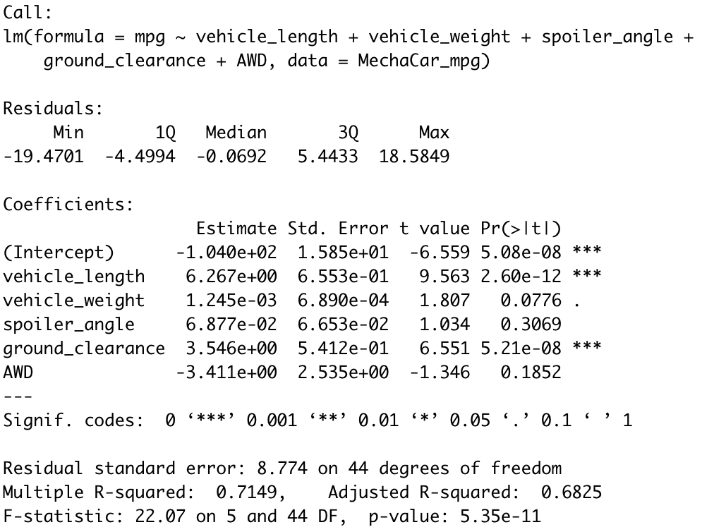
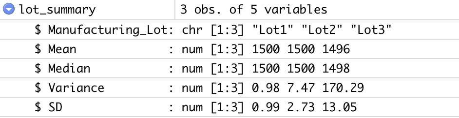
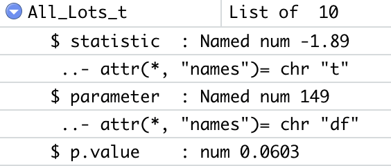
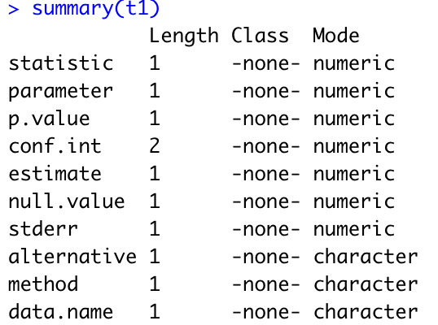
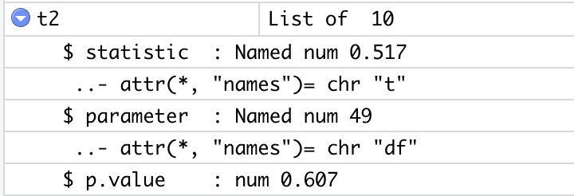
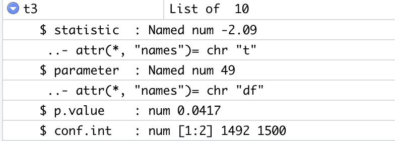

# MechaCar_Statistical_Analysis
Click here to view the R-script: [MechaCarChallenge.RScript](https://github.com/DevTrav/MechaCar_Statistical_Analysis/blob/main/MechaCarChallenge.R)

## Project Overview
The goal of the project is to analyze metrics that can affect the manufacturing a new car prototype and compare vehicle performance across different manufacturer lots. These metrics include vehicle length, weight, spoiler angle, ground clearance, AWD capabilities, MPG, and PSI.

## Linear Regression to Predict MPG

### Analysis

* The p-value of 5.35e-11 suggests that there is an extremely low probability that the variance is caused by random variation, and that the parameters investigated indeed have a significant correlation to the mpg data measured. The R-squared value of 0.71 shows a strong linear correlation, thus the linear model is not considered to have a zero slope. Combining the R-squared finding, demonstrating a strong linear correlation, and the p-value, demonstrating that the variance is very unlikely to be due to random variation, it can be concluded that there is a significant linear correlation between mpg and the parameters investigated.

- Meaning, it is unlikely the linear model can effectively predict the mpg of prototype cars. While there is a strong and significant correlation, there are several features in the data that make this analysis problematic, thus further analyses will be necessary to determine whether linear regression is the best model.

* `Multiple R-squared` increases as more variables are passed through the regression. However, adjusted R-squared controls against this increase, and adds penalties for the number of predictors in the model, thus making it a more accurate predictor of how effective the linear model is. An adjusted R-square of 0.6825 concludes that this linear model predicts the mpg of MechaCar prototypes relatively well.

## Summary Statistics 

- The overall variance for the entire data set indicates that the current manufacturing data meets the 100 pounds per square inch variance limitation. 

- However, when separated into three lots, the third lot demonstrates a much higher variance. Because the lots are chosen randomly, there is a possibility that a third of the lot does not meet the necessary suspension coils requirement.

The overall variance for the entire dataset indicates that the current manufacturing data meets the 100 pounds per square inch variance limitation. However, when separated into three lots, the third lot demonstrates a much higher variance. Because the lots are chosen randomly, there is a possiblity that a third of the lot does not meet the necessary suspension coils requirement.

## T-Test on Suspension Coils
### T-Test on Entire Lot

At a significance level of 0.05, we fail to reject the null hypothesis since the p-value equals 0.06. Therefore, we cannot reject the fact that the sample mean may be equivalent to the true population mean. Another feature to note is the narrow confidence interval. Although a narrower confidence interval implies that there is a smaller chance of obtaining an observation within that interval, it provides greater accuracy than a wider interval.

## T-Test on Three Smaller Lots

#### Lot 1

At a significance level of 0.05, we fail to reject the null hypothesis since the p-value equals 1. An interesting correlation between p-value and confidence intervals is that as the p-values get larger, the confidence interval becomes smaller, implying more precision in predicting the true population mean.

#### Lot 2

At a significance level of 0.05, we fail to reject the null hypthesis again since the p-value equals 0.6072. The second lot also has a relatively small confidence interval.

#### Lot 3

At a significance level of 0.05, we can reject the null hypothesis since the p-value equals 0.04168. The mean of this sample is also significantly smaller in comparison to the previous two lots. More importantly, unlike the previous two lots, the confidence interval for the third lot does not include the predicted population mean.

## Study Design: MechaCar vs. Competition
Another statistical study that can be performed to determine MechaCar's standing against its competition is a linear regression on city and highway fuel efficiency. Gasoline is expensive nowadays, and it is an important feature that many consumers look at when purchasing a new car. The metrics that can be included in this analysis are:
* City and highway fuel efficiency: dependent variable
* Horse power: independent variable
* Vehicle weight: independent variable
* AWD capabilities: independent variable
* MPG: independent variable
In addition to the MPG, AWD, and vehicle weight data that we already have, we would have to collect fuel efficiency and horse power data for the sample data set at hand.
